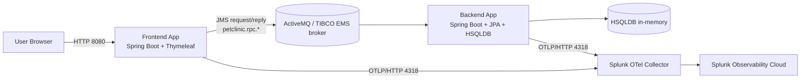

# Architecture

This repository implements a distributed variant of the Spring PetClinic sample, split into two Spring Boot applications that communicate over a JMS request/reply layer intended to model a TIBCO EMS / ActiveMatrix BusinessWorks integration.

## 1. System overview

The application is intentionally decomposed into:

- Frontend: a web application that serves the Thymeleaf UI and handles user interactions
- Backend: a data-access service that owns the persistence layer and executes operations against HSQLDB
- Broker: an ActiveMQ Classic container that provides the JMS transport layer between the two services
- Observability: a local Splunk OpenTelemetry Collector and the optional Java agent instrumentation for traces and metrics

### High-level topology

## 2. Runtime responsibilities

### Frontend app

Location: `frontend/`

Responsibilities:

- Exposes the PetClinic web interface on port `8080`
- Handles user requests and renders pages using Spring MVC + Thymeleaf
- Does not own persistent storage
- Calls backend operations via synchronous JMS request/reply using `TibcoRpcClient`
- Maps domain operations to queue names such as `petclinic.rpc.owner.findById` and `petclinic.rpc.vet.findAll`

Key patterns:

- `TibcoOwnerRepository`, `TibcoPetTypeRepository`, `TibcoVetRepository` act as repository adapters that call the backend over JMS instead of local persistence
- `TibcoRpcClient` creates a temporary reply queue, sends a JSON payload, waits for a response, and deserializes the `RpcResponse`

### Backend app

Location: `backend/`

Responsibilities:

- Exposes the data-access service on port `8081`
- Owns the JPA/Hibernate persistence layer and the HSQLDB database
- Consumes JMS RPC requests from the frontend
- Executes the corresponding repository operation and replies with a JSON envelope
- Performs validation/error translation and formats output for the caller

Key patterns:

- `TibcoRpcListener` is registered with `@JmsListener` for each queue
- `PetClinicRpcService` is the central dispatcher for operations
- A `RpcResponse` wrapper carries success/failure plus a payload and error metadata

## 3. Message contract

The frontend and backend use a queue naming convention with a shared prefix:

- `petclinic.rpc.*`

Common operations include:

- `petclinic.rpc.owner.findById`
- `petclinic.rpc.owner.findByLastName`
- `petclinic.rpc.owner.save`
- `petclinic.rpc.pettype.findAll`
- `petclinic.rpc.vet.findAll`
- `petclinic.rpc.vet.findAllPaged`

The queue names are centralized in both apps in `RpcTopics` classes.

### Request/reply flow

1. The frontend repository builds a request payload such as `OwnerDto`, `FindByIdRequest`, or a paged query object.
2. `TibcoRpcClient.call(...)` creates a JMS request message with:
   - destination: `petclinic.rpc.<operation>`
   - reply queue: a temporary queue
   - correlation ID: a generated UUID
3. The backend `@JmsListener` receives the message.
4. `PetClinicRpcService.dispatch(...)` routes the request by operation name.
5. The backend executes the repository logic, serializes the result, and sends the response back to the caller's temporary reply queue.
6. The frontend deserializes the JSON envelope and converts it into the expected domain object or paging response.

### Failure handling

The system wraps every backend operation in a structured response envelope:

- `success`: boolean flag
- `payload`: returned domain data
- `errorCode`: application-specific code when the operation fails
- `errorMessage`: human-readable reason

The frontend turns backend error codes into runtime exceptions, such as `DataIntegrityViolationException` for duplicate pet name violations.

## 4. Data and domain model

The project follows the standard PetClinic domain model with a small adaptation for remote access.

### Domain areas

- `owner` package: owners, pets, visits
- `vet` package: veterinarians and vet paging/search
- `model` package: shared domain objects such as pet types and base value types

### Persistence

The backend uses:

- Spring Data JPA
- Hibernate
- HSQLDB in-memory database
- Repository interfaces and entity mapping without a separate service layer for core persistence operations

The database is initialized in memory at application startup and seeded with PetClinic sample data.

## 5. Deployment model

### Local process model

This repo is designed to run locally without Dockerizing the Java applications themselves.

The standard workflow is:

- Start the broker in a Podman container
- Start backend and frontend as local JVM processes via Maven
- Expose ports on the host machine

Ports used by the stack:

- Frontend: `8080`
- Backend: `8081`
- ActiveMQ / JMS: `61616`
- ActiveMQ admin / Jolokia: `8161`
- OTLP gRPC: `4317`
- OTLP HTTP: `4318`
- Collector health: `13133`

### Infrastructure and scripts

The root orchestrators manage lifecycle:

- `run-all.sh`: start broker + backend + frontend
- `run-all-otel.sh`: same flow with the Splunk Java agent enabled
- `run-collector.sh`: manage the OTEL collector container
- `stop-all.sh`: stop the Java apps and broker

This makes the repository a local distributed-system reference environment rather than a traditional single-process monolith.

## 6. Observability architecture

A local OpenTelemetry Collector sits between the app JVMs and Splunk Observability Cloud.

### Instrumentation flow

- Each Spring Boot app may run with the Splunk OpenTelemetry Java agent attached
- Agent output is sent to the collector over OTLP/HTTP on `localhost:4318`
- The collector fans out telemetry to Splunk Observability Cloud
- The application itself is split into separate services in APM, which allows the frontend and backend to be monitored independently

### Broker and metrics behavior

The broker itself exposes Jolokia endpoints on port `8161` for monitoring, but the current collector configuration does not automatically scrape ActiveMQ statistics. In other words, the application and its telemetry are designed around JVM-level instrumentation rather than broker-level scraping.

## 7. Design rationale

This architecture is intended to demonstrate how a classic PetClinic monolith can be evolved into a message-driven, service-split design while staying close to the original domain model and UI structure.

The key architectural decisions are:

- Keep the user-facing frontend simple and stateless with respect to persistence
- Move all storage concerns to a dedicated backend service
- Model the communication layer as synchronous request/reply JMS calls using a broker abstraction
- Preserve the original domain semantics while separating concerns along process boundaries

## 8. Key directories

- `backend/`: backend Spring Boot application
- `frontend/`: frontend Spring Boot application
- `docs/`: project documentation and supporting notes
- `logs/`: runtime logs for local processes
- `tests/`: load and integration test assets, including k6 scenarios
- `jre/`: bundled Java runtime used by local app startup scripts

## 9. Summary

The project is a distributed Spring PetClinic reference implementation in which web requests are handled by a Thymeleaf frontend, business data is persisted by a backend service, and the two are connected via JMS request/reply queues over an ActiveMQ-compatible broker. The repository adds local operational tooling and OpenTelemetry integration to make the distributed setup easy to run and observe in a lab or demo environment.
