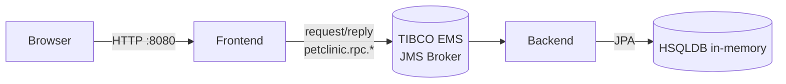
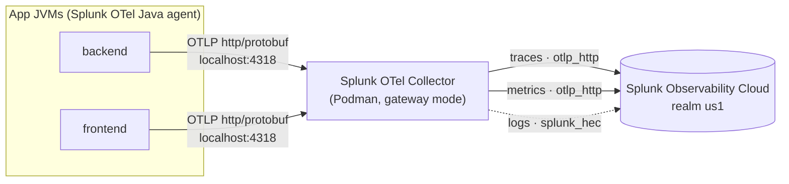

# Spring PetClinic — TIBCO-connected edition

A distributed take on the classic [Spring PetClinic](https://github.com/spring-projects/spring-petclinic)
sample. The application is split into **two standalone Spring Boot apps** that
communicate over a **TIBCO ActiveMatrix BusinessWorks / EMS** broker using the **request/reply** pattern
implemented with Spring JMS's request-reply correlation.

| Application        | Folder                   | Port     | Responsibility                                                                                                                     |
| ------------------ | ------------------------ | -------- | ---------------------------------------------------------------------------------------------------------------------------------- |
| **Frontend** | [`frontend/`](frontend) | `8080` | Thymeleaf UI + controllers. Owns no database — every read/write is a synchronous TIBCO JMS request/reply call to the backend.         |
| **Backend**  | [`backend/`](backend)   | `8081` | JPA persistence on an in-memory **HSQLDB** (seeded on startup). Consumes RPC queues, executes the operation, and replies. |

## Architecture



- The **frontend** sends a request to `petclinic.rpc.<operation>` and blocks on the
  reply (default timeout `10000 ms`, see `tibco.request.timeout-ms`).
- The **backend** listens on each `petclinic.rpc.<operation>` queue, executes the JPA
  operation, and sends the reply to the temporary queue requested by the caller.
- Message payloads are JSON (Jackson 2, shipped with Spring Boot 3.5).

### RPC queue contract

| Queue                                      | Operation                         |
| ------------------------------------------ | --------------------------------- |
| `petclinic.rpc.owner.findById`           | Load one owner (with pets/visits) |
| `petclinic.rpc.owner.findByLastName`     | Paged owner search                |
| `petclinic.rpc.owner.save`              | Create/update an owner aggregate  |
| `petclinic.rpc.pettype.findAll`         | List pet types                    |
| `petclinic.rpc.vet.findAll`             | List vets                         |
| `petclinic.rpc.vet.findAllPaged`        | Paged vet list                    |

Queue constants are defined in both apps' `RpcTopics` classes
([backend](backend/src/main/java/org/springframework/samples/petclinic/messaging/RpcTopics.java),
[frontend](frontend/src/main/java/org/springframework/samples/petclinic/messaging/RpcTopics.java)),
where `PREFIX = "petclinic.rpc."` is prepended to each operation suffix above.

#### Messaging implementation

- **Backend listener:** [`TibcoRpcListener`](backend/src/main/java/org/springframework/samples/petclinic/messaging/TibcoRpcListener.java)
  uses `@JmsListener` + `@SendTo` for each operation queue; [`TibcoConfig`](backend/src/main/java/org/springframework/samples/petclinic/messaging/TibcoConfig.java)
  enables standard Spring Boot JMS auto-configuration.
- **Frontend client:** [`TibcoRpcClient`](frontend/src/main/java/org/springframework/samples/petclinic/messaging/TibcoRpcClient.java)
  uses a pooled connection factory and standard JMS dynamic temporary queues to send requests and await replies synchronously.
- **Broker connection** (default in `application.properties`, overridable via environment):
  - `spring.activemq.broker-url=tcp://localhost:61616` — JMS broker connection URL

> **Implementation note:** both apps run on **Spring Boot 3.5** with **Spring JMS**.
> The TIBCO EMS simulation broker (Apache ActiveMQ) runs as a container with port `61616` for JMS and `8161` for Jolokia and Web Console.

## Technology Stack

### Application Framework

- **Spring Boot 3.5** — modern Java application framework
- **Spring JMS / ActiveMQ** — JMS messaging for synchronous request/reply (representing TIBCO EMS/BW)
- **Java 17** — bundled as Azul Zulu 17.0.19; set `JAVA_HOME` to override
- **Maven** — build tool (via system `mvn`)
- **Jackson 2** — JSON serialization (package `com.fasterxml.jackson`)

### Application Components

- **Frontend** (`frontend/pom.xml`) — **Thymeleaf** UI + Spring MVC controllers; exports OTLP traces/metrics via Splunk OTel Java agent
- **Backend** (`backend/pom.xml`) — **JPA/Hibernate** + **HSQLDB** in-memory; listens on RPC queues and persists data

### Event Broker & Messaging

- **TIBCO EMS (ActiveMQ Classic 2.0.0+)** — runs as a **Podman** container (`docker.io/apache/activemq-classic:latest`), mimicking TIBCO EMS
- **Ports:**
  - `61616` — JMS listener (for frontend and backend apps)
  - `8161` — Web admin UI and Jolokia statistics REST endpoint
- **Queue pattern:** `petclinic.rpc.<operation>` — frontend requestor, backend replier

### Observability

- **Splunk Distribution of OpenTelemetry Java agent** — bootstrapped via `-javaagent`; sends traces + metrics + logs (disabled by default) to OTLP/HTTP `:4318`
- **Splunk Distribution of OpenTelemetry Collector** — runs as a **Podman** container (`quay.io/signalfx/splunk-otel-collector:latest`) on `petclinic-net`; gateway mode that forwards to Splunk Observability Cloud (`realm=us1` by default)
- **ActiveMQ metrics** — not collected by the current Collector image because it does not include an `activemq` receiver; broker statistics remain available through Jolokia on `:8161`
- **OpenTelemetry pipelines** — traces (OTLP/HTTP → Splunk), metrics (OTLP/HTTP → Splunk), logs (HEC, requires Log Observer)

### Runtime & Containerization

- **Podman v6.0.2+** — container orchestration (macOS: applehv VM `podman-machine-default`, rootless)
- **`petclinic-net`** — custom Podman network shared by the TIBCO (ActiveMQ) and OTel Collector containers for DNS resolution (`petclinic-tibco`)
- **Scripting** — bash orchestration (`run-all.sh`, `run-otel.sh`, `run-collector.sh`, `stop-all.sh`)
- **Ports:**
  - Frontend: `:8080`
  - Backend: `:8081`
  - TIBCO / ActiveMQ JMS: `:61616`
  - TIBCO / ActiveMQ Web Console: `:8161`
  - OTel Collector OTLP/gRPC: `:4317`
  - OTel Collector OTLP/HTTP: `:4318`
  - OTel Collector health: `:13133`

## Prerequisites

- **JDK 17+** (full JDK, not a JRE)
- **Maven** on your `PATH` (the bundled `./mvnw` wrapper is not configured in this
  repo, so the scripts fall back to system `mvn`)
- **Podman** (or Docker), to run the TIBCO EMS Broker and OTel Collector
- `curl`, `nc`, and `lsof` (used by the start/stop scripts for health checks and
  shutdown; preinstalled on macOS)
- **`petclinic-net` Podman network** — shared by TIBCO and the OTel Collector for
  DNS resolution; create it once if it does not already exist:
  ```bash
  podman network create petclinic-net
  ```

## Running the distributed edition

The quickest way is the **`run-all.sh`** orchestrator, which starts the broker,
waits for it, then brings up the apps in order:

```bash
./run-all.sh            # start tibco + backend + frontend (default)
./run-all.sh apps       # backend then frontend (broker already running)
./run-all.sh tibco      # just the broker (detached container)
./run-all.sh backend    # just the backend (foreground, live logs, Ctrl+C stops)
./run-all.sh frontend   # just the frontend (foreground, live logs, Ctrl+C stops)
```

- A **single** requested app runs in the foreground with live logs (Ctrl+C stops it).
- **Multiple** apps run in the background with logs written to [`logs/`](logs) and
  are stopped together with Ctrl+C.
- The **broker** always runs detached; stop it with `./stop-all.sh tibco`.

Stop services with the mirror script **`stop-all.sh`** (reverse order:
frontend, backend, tibco):

```bash
./stop-all.sh           # stop everything (default)
./stop-all.sh apps      # stop frontend + backend, leave the broker up
./stop-all.sh frontend  # stop just the frontend
./stop-all.sh tibco     # stop and remove the broker container
```

### Running with the Splunk OpenTelemetry Java agent

To bring the stack up with each app instrumented by the **Splunk Distribution of
OpenTelemetry Java agent**, use **`run-otel.sh`** instead of `run-all.sh`. It
launches the packaged Spring Boot fat jars directly (one JVM per app) with
`-javaagent` bootstrapped, so each app reports as its own service in Splunk APM:

```bash
./run-otel.sh            # broker + backend + frontend, agent attached (default)
./run-otel.sh apps       # backend then frontend (broker already up)
./run-otel.sh backend    # just the backend (foreground, live logs)
./run-otel.sh build      # force a `mvn package` rebuild before starting
OTEL_ENABLED=false ./run-otel.sh apps   # run the jars without the agent
```

The script launches the apps as packaged Spring Boot fat jars (not via Maven) with the Splunk OTel Java agent attached via `-javaagent`. Each app reports to Splunk APM as its own service:

- **Backend:** `gary-petclinic-tibco-backend`
- **Frontend:** `gary-petclinic-tibco-frontend`

**Runtime environment:** Apps run on the bundled **Azul Zulu 17.0.19** JRE in [`jre/`](jre); override with `JAVA_HOME` if needed.

**Telemetry routing:** Traces and metrics are always sent to the **local Collector** on `localhost:4318` (OTLP/HTTP). Logs are disabled by default (see the [logs caveat](#collector-logs-a-404-not-found-on-v1log-and-drops-data) below). The script forces `-Dsplunk.realm=none` on the agent to prevent a `SPLUNK_REALM` value in `.env` from making the agent bypass the Collector and send directly to Splunk. If the Collector is not already running, `run-otel.sh` starts it automatically (see [The Splunk OpenTelemetry Collector](#the-splunk-opentelemetry-collector) below).

**Configuration:** Agent settings are in a config block at the top of `run-otel.sh` and can be overridden from the environment (e.g. `OTEL_SERVICE_NAME`, `OTEL_EXPORTER_OTLP_ENDPOINT`, `OTEL_RESOURCE_ATTRIBUTES`, `OTEL_LOGS_EXPORTER`). For defaults, see the [Observability defaults table](#observability-defaults-in-run-otelsh) above.

**Credentials:** The realm and access token belong to the **Collector**, not the agent. Both `run-otel.sh` and `run-collector.sh` auto-load them from a gitignored **`.env`** file in the repo root — copy [`.env.example`](.env.example) to `.env` and fill in your Splunk realm and org access token.

**Stopping:** Use `./stop-all.sh` to stop the apps and broker (the Collector stays running). Stop just the Collector with `./run-collector.sh stop`.

Once the stack is up, open the **launcher page** [`index.html`](index.html) in a
browser for quick links, or go straight to:

| Service                | URL                                                                           | Notes                            |
| ---------------------- | ----------------------------------------------------------------------------- | -------------------------------- |
| PetClinic UI           | [http://localhost:8080/](http://localhost:8080/)                               | Thymeleaf frontend               |
| Backend health         | [http://localhost:8081/actuator/health](http://localhost:8081/actuator/health) | Spring Boot Actuator             |
| OTel Collector health  | [http://localhost:13133/](http://localhost:13133/)                             | Returns JSON status              |

### The Splunk OpenTelemetry Collector

Instead of shipping telemetry from each JVM straight to Splunk Observability
Cloud, the apps export to a **local Splunk Distribution of the OpenTelemetry
Collector** running as a Podman container on `petclinic-net`. The Collector fans
the data out to the cloud and also scrapes TIBCO EMS (ActiveMQ) broker metrics directly:



**Manage it with [`run-collector.sh`](run-collector.sh):**

```bash
./run-collector.sh start    # pull (if needed) and (re)start the Collector [default]
./run-collector.sh status   # show container state and published ports
./run-collector.sh logs     # follow the Collector logs
./run-collector.sh restart  # stop then start the Collector
./run-collector.sh stop     # stop and remove the Collector container
```

> Aliases: `up` = `start`, `down` = `stop` (backward-compatible with older scripts).

`run-otel.sh` also calls the Collector automatically: before it launches the app
JVMs it checks the health endpoint and runs `./run-collector.sh start` if nothing is
listening, so `./run-otel.sh` is enough to bring up the whole pipeline.

**How it starts.** `run-collector.sh start` runs the image detached with a restart
policy on `petclinic-net`, mounts [`otel-tibco-metrics.yaml`](otel-tibco-metrics.yaml)
as the active config, injects credentials from `.env` via the environment, and waits
for the container to report healthy on `:13133`:

```bash
podman run -d --replace --name splunk-otel-collector --restart unless-stopped \
  --network petclinic-net \
  -v ./otel-tibco-metrics.yaml:/etc/otel/collector/tibco_metrics_config.yaml \
  -e SPLUNK_ACCESS_TOKEN -e SPLUNK_REALM \
  -e SPLUNK_CONFIG=/etc/otel/collector/tibco_metrics_config.yaml \
  -e SPLUNK_MEMORY_TOTAL_MIB=512 -e SPLUNK_LISTEN_INTERFACE=0.0.0.0 \
  -p 4317:4317 -p 4318:4318 -p 13133:13133 \
  quay.io/signalfx/splunk-otel-collector:latest
```

**Configuration.** Everything is driven by environment variables (set them in
`.env`, or export them to override the script defaults):

| Variable                    | Default                                           | Purpose                                                        |
| --------------------------- | ------------------------------------------------- | -------------------------------------------------------------- |
| `SPLUNK_REALM`            | _(required)_                                    | Splunk O11y realm, e.g.`us1` — derives the cloud endpoints. |
| `SPLUNK_ACCESS_TOKEN`     | _(required)_                                    | Org access token used to authenticate ingest.                  |
| `SPLUNK_CONFIG`           | `/etc/otel/collector/tibco_metrics_config.yaml` | Mounted overlay config (OTLP receivers + Splunk exporters).    |
| `SPLUNK_MEMORY_TOTAL_MIB` | `512`                                           | Total memory budget for the`memory_limiter` processor.       |
| `SPLUNK_LISTEN_INTERFACE` | `0.0.0.0`                                       | Bind address inside the container (so published ports work).   |
| `SPLUNK_COLLECTOR_IMAGE`  | `quay.io/signalfx/splunk-otel-collector:latest` | Collector image to run.                                        |
| `SPLUNK_COLLECTOR_NAME`   | `splunk-otel-collector`                         | Container name.                                                |
| `COLLECTOR_HEALTH_URL`    | `http://localhost:13133`                        | Health endpoint the scripts poll before continuing.            |

**Published ports:** `4317` (OTLP/gRPC), `4318` (OTLP/HTTP — the agent target),
and `13133` (health check).

#### OTel Collector config: `otel-tibco-metrics.yaml`

The Collector loads [`otel-tibco-metrics.yaml`](otel-tibco-metrics.yaml) (mounted
at startup) instead of the stock `gateway_config.yaml`. It wires OTLP ingest to
the Splunk exporters:

| Pipeline  | Receivers                    | Processors              | Exporters                     |
| --------- | ---------------------------- | ----------------------- | ----------------------------- |
| `traces`  | `otlp`                     | `attributes`, `batch` | `otlp_http/traces`          |
| `metrics` | `otlp`                     | `attributes`, `batch` | `otlp_http/metrics`, `debug` |

> The current Splunk Collector image does not bundle either the native
> `activemq` receiver or the legacy `collectd/activemq` Smart Agent monitor.
> Adding either one causes the Collector to reject the configuration and exit.

**Bundled export endpoints** (all derived from `SPLUNK_REALM`):

| Signal  | Exporter            | Destination                                                    |
| ------- | ------------------- | -------------------------------------------------------------- |
| Traces  | `otlp_http/traces`  | `https://ingest.<realm>.signalfx.com/v2/trace/otlp`          |
| Metrics | `otlp_http/metrics` | `https://ingest.<realm>.observability.splunkcloud.com/v2/datapoint/otlp` |
| Logs    | `splunk_hec`        | `${SPLUNK_HEC_URL}` (`/v1/log`)                              |

> The collector image is **distroless** (no shell/`cat`); to inspect the mounted
> config or the bundled configs, copy them out with
> `podman cp splunk-otel-collector:/etc/otel/collector/ ./collector-config/`.
>
> **Logs caveat:** Splunk Observability Cloud only ingests logs when the org has
> **Log Observer** (a valid `SPLUNK_HEC_URL` + HEC token); otherwise the
> `splunk_hec` exporter 404s on `/v1/log` and drops the data. `run-otel.sh`
> therefore ships **traces and metrics only** by default (`OTEL_LOGS_EXPORTER=none`).
> Wire a working `SPLUNK_HEC_URL`/`SPLUNK_HEC_TOKEN` into the Collector and start
> the apps with `OTEL_LOGS_EXPORTER=otlp` to forward logs as well.

#### Getting into / debugging the Collector container

You **can't** open a shell inside the Collector — the image is distroless, so its
only executable is the `/otelcol` entrypoint (there's no `/bin/sh`, `ls`, or
`cat`, and `podman exec -it … ` fails with exit code `125`). Use these instead:

```bash
# 1. Run the collector binary (the only executable in the image)
podman exec splunk-otel-collector /otelcol --version      # -> otelcol version vX.Y.Z
podman exec splunk-otel-collector /otelcol components      # list receivers/exporters/etc.

# 2. Read files out of the container (no shell needed)
podman cp splunk-otel-collector:/etc/otel/collector/gateway_config.yaml -   # to stdout
podman cp splunk-otel-collector:/etc/otel/collector/ ./collector-config/    # to a folder

# 3. Get a real shell that shares the collector's network + PID namespaces,
#    then browse its filesystem via /proc/1/root
podman run --rm -it \
  --pid=container:splunk-otel-collector \
  --network=container:splunk-otel-collector \
  docker.io/nicolaka/netshoot
#   inside: ls -l /proc/1/root/etc/otel/collector/ ; curl -s localhost:13133 ; ss -ltnp

# 4. Logs and metadata from the host (no exec)
podman logs -f splunk-otel-collector      # or: ./run-collector.sh logs
podman inspect splunk-otel-collector
```

To SSH into the **Podman VM** itself (not the container) use `podman machine ssh`.
To get a shell *inside* the Collector — since Splunk publishes only distroless
images — build your own debug image by copying the binary and config from the
official image into a base with a shell (e.g. `FROM debian:bookworm-slim`), then
point `SPLUNK_COLLECTOR_IMAGE` to your local image in `.env`.

### Starting the services manually

If you prefer to run each piece yourself:

0. **Create the shared network** (once):

   ```bash
   podman network create petclinic-net
   ```

1. **Start the TIBCO EMS Broker** (ActiveMQ Classic mimicking TIBCO EMS):

   ```bash
   podman run -d --name petclinic-tibco \
     --network petclinic-net \
     -p 61616:61616 \
     -p 8161:8161 \
     docker.io/apache/activemq-classic:latest
   ```

   Wait for port `61616` to be open before starting the apps:
   ```bash
   until nc -z localhost 61616; do sleep 1; done
   ```
2. **Start the backend** (persistence + replier):

   ```bash
   mvn -f backend/pom.xml spring-boot:run
   ```
3. **Start the frontend** (UI + requestor):

   ```bash
   mvn -f frontend/pom.xml spring-boot:run
   ```
4. Open the PetClinic UI at [http://localhost:8080/](http://localhost:8080/).

Both apps read their broker coordinates from `spring.activemq.*` properties in their
`application.properties`:

| Property                              | Default            |
| ------------------------------------- | ------------------ |
| `spring.activemq.broker-url`          | `tcp://localhost:61616` |
| `tibco.request.timeout-ms`            | `10000`            |

Override them with environment variables when pointing at a different broker.

### Observability defaults in `run-otel.sh`

When using `./run-otel.sh`, the bundled Splunk OpenTelemetry Java agent applies these
defaults (override from environment):

| Variable                        | Default                                            | Purpose                                                |
| ------------------------------- | -------------------------------------------------- | ------------------------------------------------------ |
| `OTEL_SERVICE_NAME`           | _(per-app: tibco-backend/tibco-frontend)_        | Service name reported to Splunk APM.                   |
| `OTEL_EXPORTER_OTLP_ENDPOINT` | `http://localhost:4318`                          | Collector HTTP endpoint (OTLP/HTTP, not direct cloud). |
| `OTEL_EXPORTER_OTLP_PROTOCOL` | `http/protobuf`                                  | OTLP protocol.                                         |
| `OTEL_LOGS_EXPORTER`          | `none`                                           | Disable agent log export (requires Log Observer).      |
| `OTEL_RESOURCE_ATTRIBUTES`    | `deployment.environment=lab,service.version=1.0` | Resource metadata.                                     |
| `OTEL_ENABLED`                | `true`                                           | Set to `false` to run jars without the agent.         |

## Viewing logs

When `run-all.sh` runs apps in the background, each writes to its own file under
[`logs/`](logs). Tail them to watch what a service is doing:

```bash
# frontend (UI + TIBCO requestor)
tail -f logs/frontend.log

# backend (persistence + TIBCO replier)
tail -f logs/backend.log
```

If you started an app in the **foreground** (e.g. `./run-all.sh backend`), its log
is printed straight to the terminal instead of a file.

The **TIBCO EMS broker** logs come from the container:

```bash
# follow the broker's logs
./tail-tibco.sh

# last 200 lines only
./tail-tibco.sh tail 200
```

## Troubleshooting

### Collector logs a `404 Not Found` on `/v1/log` and drops data

**Symptom** — the Collector logs repeat an error like:

```
Exporting failed. Dropping data. ... "error": "Permanent error: \"HTTP/... 404 Not Found\"" ...
exporter: splunk_hec ... url: .../v1/log
```

**Cause** — the app's OTel Java agent is exporting **logs** to the Collector,
whose `splunk_hec` exporter POSTs them to `.../v1/log`. Splunk Observability Cloud
only accepts that endpoint when the org has **Log Observer** provisioned (a valid
`SPLUNK_HEC_URL` + HEC token). Without it, every log batch 404s, is retried, and
then dropped. Traces and metrics are unaffected.

**Fix** — `run-otel.sh` disables agent log export by default
(`OTEL_LOGS_EXPORTER=none`, passed to the agent as `-Dotel.logs.exporter=none`), so
no logs reach the Collector and there is nothing for `splunk_hec` to drop. The
change only takes effect on app **restart**; if the Collector is still retrying a
queued batch, restart it too with `./run-collector.sh restart`.

**To actually send logs** — provision Log Observer, wire a working
`SPLUNK_HEC_URL` / `SPLUNK_HEC_TOKEN` into the Collector's `splunk_hec` exporter,
then start the apps with log export turned back on:

```bash
OTEL_LOGS_EXPORTER=otlp ./run-otel.sh
```

Verify the errors are gone after restarting:

```bash
podman logs splunk-otel-collector 2>&1 | grep -aE 'splunk_hec|/v1/log|404|Dropping data'
```

### TIBCO EMS metrics: `connect: connection refused` during Collector startup

**Symptom** — the Collector logs show scrape errors on the `activemq` receiver
shortly after starting:

```
Failed to scrape ... dial tcp petclinic-tibco:8161: connect: connection refused
```

**Cause** — the `activemq` receiver starts scraping immediately and the TIBCO EMS 
(ActiveMQ) broker has not yet finished initialising.

**Fix** — [`otel-tibco-metrics.yaml`](otel-tibco-metrics.yaml) sets
`initial_delay: 45s` on the receiver. If you still see errors, increase this value.
The errors are transient and stop once the broker is accepting connections.

### Backend or frontend cannot connect to TIBCO EMS

**Symptom** — app fails to start or hangs with JMS connection errors.

**Checks:**
1. Confirm TIBCO is running: `podman ps | grep petclinic-tibco`
2. Confirm port `61616` is reachable from the host: `nc -z localhost 61616`
3. If the container exists but is stopped: `podman start petclinic-tibco`
4. Both apps default to `spring.activemq.broker-url=tcp://localhost:61616`. If you
   run the apps inside a container, change this to `tcp://petclinic-tibco:61616` (the
   container-network listener) and ensure the container is on `petclinic-net`.

### Cannot get a shell inside the OTel Collector container

The Collector image is **distroless** — there is no `/bin/sh`, `ls`, or `cat`.
`podman exec -it splunk-otel-collector /bin/sh` will fail. Use these instead:

```bash
# 1. Run the collector binary (the only executable in the image)
podman exec splunk-otel-collector /otelcol --version
podman exec splunk-otel-collector /otelcol components

# 2. Read files out of the container (no shell needed)
podman cp splunk-otel-collector:/etc/otel/collector/ ./collector-config/

# 3. Get a real shell that shares the collector's network + PID namespaces
podman run --rm -it \
  --pid=container:splunk-otel-collector \
  --network=container:splunk-otel-collector \
  docker.io/nicolaka/netshoot
#   inside: curl -s localhost:13133 ; ss -ltnp

# 4. Logs from the host (no exec needed)
podman logs -f splunk-otel-collector      # or: ./run-collector.sh logs
podman inspect splunk-otel-collector
```

## Building container images

There is no `Dockerfile`. Build an OCI image for each app with the Spring Boot
build plugin:

```bash
mvn -f backend/pom.xml spring-boot:build-image
mvn -f frontend/pom.xml spring-boot:build-image
```

Run the backend image (TIBCO must already be running on `petclinic-net`):

```bash
podman run --network petclinic-net \
  -e SPRING_ACTIVEMQ_BROKER_URL=tcp://petclinic-tibco:61616 \
  -p 8081:8081 \
  docker.io/library/spring-petclinic-backend:4.0.0-SNAPSHOT
```

Run the frontend image similarly with `-e SPRING_ACTIVEMQ_BROKER_URL=tcp://petclinic-tibco:61616 -p 8080:8080`.

## License

The Spring PetClinic sample application is released under version 2.0 of the
[Apache License](https://www.apache.org/licenses/LICENSE-2.0). See
[LICENSE.txt](LICENSE.txt).
